<div align="center">


<br/>

[](https://unity.com/)
[](https://dotnet.microsoft.com/)
[](https://www.jetbrains.com/rider/)
[]()
[]()

[](LICENSE)
[]()
[]()
[]()
[]()

</div>

---

<div align="center">

## 🌌 About The Project

</div>

**Galactic Empire** is a **Sci-Fi 4X Real-Time Strategy** game — an improved reimagining of classic space strategy games, rebuilt from the ground up using the most advanced technologies in the Unity ecosystem.

<div align="center">

```
Build your empire. Command your fleets. Conquer the galaxy.
```
**Procedurally generated universe · Real-time tactical battles · Alliance warfare**

</div>

<br/>

<table align="center">
<tr>
<td align="center" width="33%">🎮<br/><b>A complete, shippable game</b><br/><sub>deep mechanics, modern visuals</sub></td>
<td align="center" width="33%">🏆<br/><b>A senior-level portfolio</b><br/><sub>mastery across 12 tech domains</sub></td>
<td align="center" width="33%">📚<br/><b>A reference architecture</b><br/><sub>production-grade Unity dev</sub></td>
</tr>
</table>

<br/>

<div align="center">

### 🚀 Where the project actually stands right now


| 🧪 Tests | 🏗️ Phase | 🌐 Galaxy | ⚔️ Battle | 🖥️ UI |
|:---:|:---:|:---:|:---:|:---:|
| **103 / 103** ✅ | **7 · Etap 3** | 30 sectors live | Domain + Service ✅ | MainMenu→HUD→Galaxy ✅ |

</div>

---

<div align="center">

## ⚡ Tech Stack

*What's actually built, first — everything else, collapsed below.*

</div>

<br/>

<details open>
<summary><b>🟣 C# 13 & .NET 10 — Advanced Language Mastery</b></summary>
<br/>


</details>

<details open>
<summary><b>🟣 Unity 6 LTS — Core Systems (6000.3.12f1)</b></summary>
<br/>


-In_Use-1D9E75?style=flat-square)


</details>

<details open>
<summary><b>🟢 Architecture & Design Patterns — the backbone of this repo</b></summary>
<br/>


-In_Use-1D9E75?style=flat-square)


</details>

<details open>
<summary><b>🔴 Performance Engineering — DOTS / ECS Stack</b></summary>
<br/>


</details>

<br/>

<details>
<summary><b>🔭 Planned / future technology domains</b> — <sub>not yet in the codebase, tracked here so the roadmap stays honest</sub></summary>
<br/>

<details>
<summary>🔴 GPU & Bleeding-Edge Graphics</summary>
<br/>


-Rare-FF4757?style=flat-square)
-Rare-FF4757?style=flat-square)

-Expert-D85A30?style=flat-square)
-Expert-D85A30?style=flat-square)
-Advanced-D85A30?style=flat-square)

</details>

<details>
<summary>🩷 AI & Machine Learning in Gameplay</summary>
<br/>

-Rare-FF4757?style=flat-square)


</details>

<details>
<summary>🔵 Multiplayer & Networking — Phase 8</summary>
<br/>


-Rare-FF4757?style=flat-square)


</details>

<details>
<summary>🔵 Backend & Cloud Infrastructure</summary>
<br/>


-Expert-378ADD?style=flat-square)


</details>

<details>
<summary>🟢 Procedural Generation</summary>
<br/>


</details>

<details>
<summary>🟡 Spatial Computing & XR</summary>
<br/>

-Rare-FF4757?style=flat-square)

-Advanced-BA7517?style=flat-square)

</details>

<details>
<summary>🟢 CI/CD, Testing & DevOps</summary>
<br/>


</details>

</details>

---

<div align="center">

## 🏗️ Architecture

### Clean Architecture × Vertical Slice — the real, current structure

*Legacy `Code/` (horizontal layers) is being migrated feature-by-feature into `Source/Features/` (vertical slices).
Battle, Fleet, Galaxy and Station domains have already moved — only shared config/logger primitives remain in `Code/Core/`.*

```mermaid
graph TD
    subgraph SF["📁 Source/Features/  —  ✅ ACTIVE, Vertical Slice"]
        direction TB
        subgraph Battle["🚀 Battle"]
            BD["Domain<br/><sub>BattleEntity · BattleResult</sub>"]
            BA["Application<br/><sub>IBattleService · CombatTickService</sub>"]
            BD --> BA
        end
        subgraph Fleet["🛰️ Fleet"]
            FD["Domain<br/><sub>FleetEntity · ShipEntity · ShipType</sub>"]
            FA["Application<br/><sub>IFleetService · CQRS commands</sub>"]
            FI["Infrastructure<br/><sub>FleetRepositorySO</sub>"]
            FP["Presentation<br/><sub>fleet UI screens</sub>"]
            FD --> FA --> FI --> FP
        end
        subgraph Galaxy["🌌 Galaxy"]
            GD["Domain<br/><sub>SectorEntity · GalaxyMapEntity</sub>"]
            GA["Application<br/><sub>IGalaxyService · GeneratorService</sub>"]
            GI["Infrastructure<br/><sub>GalaxyRepositorySO</sub>"]
            GP["Presentation<br/><sub>GalaxyMapRenderer · Presenter · Screen</sub>"]
            GD --> GA --> GI --> GP
        end
        subgraph Station["🏗️ Station"]
            SD["Domain<br/><sub>StationEntity · GridCell · ModuleEntity</sub>"]
            SA["Application<br/><sub>IStationRepository · IResourceService</sub>"]
            SI["Infrastructure<br/><sub>StationRepositorySO · ModuleSO</sub>"]
            SP["⏳ Presentation<br/><sub>NOT STARTED — Etap 3 Step 2</sub>"]
            SD --> SA --> SI -.-> SP
        end
        subgraph UI["🖥️ UI"]
            UC["Core<br/><sub>IScreen · ScreenBase · UIManager</sub>"]
            US["Screens<br/><sub>MainMenu · HUD · GalaxyMap</sub>"]
            UC --> US
        end
    end

    subgraph LG["📁 Code/  —  ⚠️ LEGACY, shrinking"]
        direction TB
        LC["Core<br/><sub>GameConfigSO · GELogger · ResourceWallet</sub>"]
        LP["Presentation<br/><sub>GameBootstrapper (DI root) · GameEntryPoint</sub>"]
        LE["Editor<br/><sub>SceneValidator · CodeHealthChecker</sub>"]
        LT["Tests<br/><sub>103 / 103 passing</sub>"]
    end

    subgraph DATA["📁 Data/  —  ScriptableObject instances"]
        DAT["Fleet · Galaxy · Station assets<br/><sub>GameConfig.asset — zero magic numbers</sub>"]
    end

    LP -.DI wires everything.-> Battle
    LP -.DI wires everything.-> Fleet
    LP -.DI wires everything.-> Galaxy
    LP -.DI wires everything.-> Station
    Fleet -.reads.-> DATA
    Galaxy -.reads.-> DATA
    Station -.reads.-> DATA

    style SF fill:#0D0D1F,stroke:#1D9E75,stroke-width:2px,color:#fff
    style LG fill:#0D0D1F,stroke:#D85A30,stroke-width:2px,color:#fff
    style DATA fill:#0D0D1F,stroke:#7F77DD,stroke-width:2px,color:#fff
    style Battle fill:#1a1a3e,stroke:#7F77DD,color:#fff
    style Fleet fill:#1a1a3e,stroke:#7F77DD,color:#fff
    style Galaxy fill:#1a1a3e,stroke:#7F77DD,color:#fff
    style Station fill:#1a1a3e,stroke:#7F77DD,color:#fff
    style UI fill:#1a1a3e,stroke:#7F77DD,color:#fff
    style SP fill:#3e2a1a,stroke:#D85A30,color:#fff
```

</div>



<br/>

<table align="center">
<tr>
<td align="center" width="25%"><br/><sub>pure C# · zero Unity deps<br/>immutable sealed records</sub></td>
<td align="center" width="25%"><br/><sub>CQRS commands + services<br/>no Unity types</sub></td>
<td align="center" width="25%"><br/><sub>ScriptableObjects<br/>Unity-facing adapters</sub></td>
<td align="center" width="25%"><br/><sub>MonoBehaviours<br/>UI Toolkit, entry points</sub></td>
</tr>
</table>

<div align="center">

**Dependency flow — one direction only:**
`Presentation → Infrastructure → Application → Domain`

</div>

---

<div align="center">

## 📈 Development Roadmap

*Not a wishlist — this reflects verified, tested state as of Phase 7 Etap 3.*

**6 / 9 phases complete**


</div>

<div align="center">

| ✅ 1 | ✅ 2 | ✅ 3 | ✅ 4 | ✅ 5 | ✅ 6 | 🔄 7 | ⏳ 8 | ⏳ 9 |
|:---:|:---:|:---:|:---:|:---:|:---:|:---:|:---:|:---:|
| Setup | Core | Station | Fleet | Galaxy | Battle | **UI/UX** | MP | Polish |

</div>

| # | Phase | Key Technologies | Status |
|:---:|---|---|:---:|
| 1 | **Project Setup** | Git, Assembly Definitions, EditorConfig, UPM | ✅ **Done** |
| 2 | **Core Architecture** | Clean Arch, VContainer, CQRS, DI bootstrap | ✅ **Done** |
| 3 | **Space Station** | Grid system, ScriptableObjects, Resource pipeline | ✅ **Done** |
| 4 | **Fleet System** | Modular ships, Blueprints, Dispatch/Recall CQRS | ✅ **Done** |
| 5 | **Galaxy Map** | Poisson Disk generation, fog of war, sector graph | ✅ **Done** |
| 6 | **Battle System** | Tick-based combat resolution, domain + service | ✅ **Done** |
| 7 | **UI / UX** | UI Toolkit screens, GalaxyMapScreen | 🔄 **In Progress** |
| 8 | **Multiplayer** | Photon Fusion 2, CSP, Netcode for Entities | ⏳ Planned |
| 9 | **Polish & Ship** | Custom shaders, SSGI, Optimization, CI/CD, Build | ⏳ Planned |

<div align="center">

🔨 **Right now:** building `StationBuilderScreen` — grid visualization + place/remove modules,
mirroring the `GalaxyMapRenderer` / `GalaxyMapPresenter` pattern already proven in Phase 5-7.

</div>

---

<div align="center">


</div>
